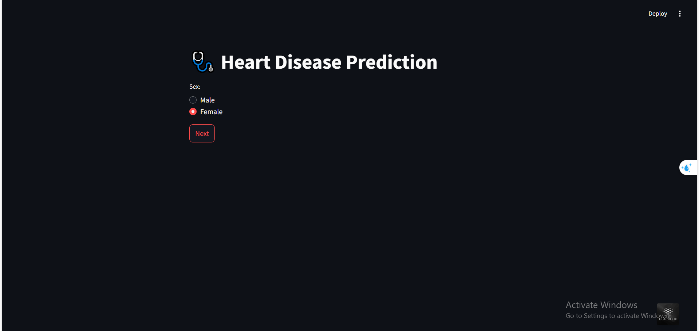

# 🫀 Heart Disease Prediction

## 📸 Project Snapshots  
.png)  
.png)  
 

## 📌 Project Overview  
This project aims to predict the risk of heart disease using machine learning models trained on health-related data. The system analyzes patient information, processes it through a trained model, and provides predictions based on health indicators.

## 📊 Features  
- **Data Analysis:** Performed extensive exploratory data analysis (EDA) to understand patterns and relationships in the dataset.  
- **Machine Learning Model:** Developed and trained a predictive model with **94% accuracy** using various preprocessing and feature engineering techniques.  
- **Streamlit Web App:** Built an interactive **Streamlit** application that allows users to input their health data and receive real-time predictions.  

## 🚀 Technologies Used  
- **Python**
- **Pandas, NumPy, Matplotlib, Seaborn** (Data Analysis & Visualization)
- **Scikit-Learn, Joblib** (Model Training & Deployment)
- **Streamlit** (Web Application Development)

## 📂 Project Structure  
- `app.py` → Streamlit web application  
- `heart_2022_no_nans.csv` → Cleaned dataset used for training  
- `heart_prediction_94%_pickle` → Trained model file  
- `encoder_dict.pkl` → Encoders for categorical features  
- `main.ipynb` → Jupyter Notebook with data analysis and model training  
- `README.md` → Project documentation  

## 🏥 How It Works  
1. The user provides input health-related data via the **Streamlit** app.  
2. The system encodes categorical values and preprocesses numeric features.  
3. The trained machine learning model predicts the likelihood of heart disease.  
4. The result is displayed as **Low Risk** or **High Risk** with relevant insights.  

## 📌 Future Enhancements  
- Implement additional ML models to compare performance.  
- Deploy the app on **Streamlit Cloud** for wider accessibility.  
- Integrate **real-time monitoring** and user history tracking.  

🔗 **Stay tuned for updates!**  

